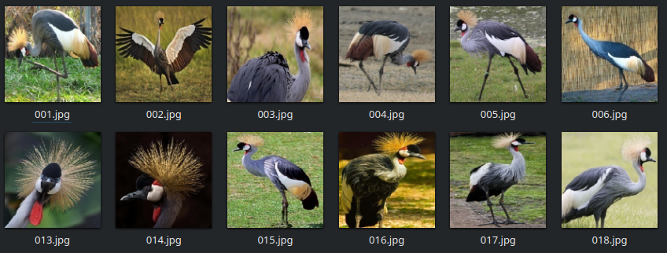

  

# Blood detection in Dark-field Microscopy Images

This dataset1 contains 40919 images from 285 classes of birds. The classificaton of birds involves the grouping of birds into categories according to physiological similarities, this classification is also known as taxonomy, and involves a complex expertise. The most imortant reason to study birds is to further our understanding of the ecosystem that support all life on earth. Birds are a critical element to nearly every ecosystem on earth, and their fate is intertwined with ours. Have a good classification and control over birds can help understand better migrations and other characteristics to help the earth.

The data can be used to build and train an ML model that classify over 300 birds species.

# Structure

This repo contains the following structure:

- **images**: directory of training images subdivided in birds specimens.
- **data.csv**: CSV file that maps images and corresponding labels.

  

The following shows a partial example of the data stored in **data.csv**:

| filepaths | labels |
|-----------|--------|
| images/AFRICAN CROWNED CRANE/001.jpg | AFRICAN CROWNED CRANE |
| images/AFRICAN CROWNED CRANE/002.jpg | AFRICAN CROWNED CRANE |
| images/AFRICAN CROWNED CRANE/003.jpg | AFRICAN CROWNED CRANE |
| images/AFRICAN CROWNED CRANE/004.jpg | AFRICAN CROWNED CRANE |
| images/AFRICAN CROWNED CRANE/005.jpg | AFRICAN CROWNED CRANE |
| images/AFRICAN CROWNED CRANE/006.jpg | AFRICAN CROWNED CRANE |
| images/AFRICAN CROWNED CRANE/007.jpg | AFRICAN CROWNED CRANE |
| images/AFRICAN CROWNED CRANE/008.jpg | AFRICAN CROWNED CRANE |

# Community

Got questions, feedback, or want to join a community of machine learning practitioners working with exciting tools and projects? Check out our [Community](https://forum.perceptilabs.com/)!

1 Dataset Credits: https://www.kaggle.com/gpiosenka/100-bird-species

